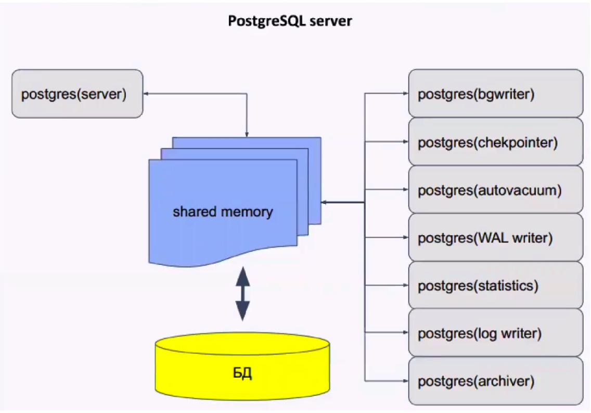

# PostgreSQL-Backup_Replication

### Цель
  
Настроить репликацию и создание резервных копий в СУБД PostgreSQL  
  
### Описание задания
  
1) Настроить hot_standby репликацию с использованием слотов
2) Настроить правильное резервное копирование
  
  ### Введение
PostgreSQL — свободная объектно-реляционная система управления базами данных (СУБД). 
Основные термины в Postgres:
Кластер - объединение нескольких баз данных. В postgres это означает что на одном хосте создаётся несколько баз сразу. 
База данных - физическое объединение объектов
Схема - логическое объединение таблиц в базе данных. По умолчанию в postgres создаётся одна схема под названием Public
По умолчанию в кластере находятся:
- template0 - read only БД, содержащая инициализационный набор данных
- template1 - база-шаблон для создания новых баз
- postgres (при желании можно поменять название). В базе находятся служебные таблицы, можно также использовать данную базу для своих нужд, но это не рекомендуется.

Управлять базами, таблицами и данными можно не только с помощью консольной утилиты psql, но и с помощью GUI-утилит, например pgAdmin, Dbeaver  и т. д.

Postgres - это мультироцессное приложение. Состоит из главного процесса (postgres), который отвечает за подключение клиентов, взаимодействие с кэшом и отвечает за остальные процессы (background processes).
  

  
Основные конфигурационные файлы в Postgres: 
- pg_hba.conf -  файл задаёт способ доступа к базам и репликации из различных источников.
- postgresql.conf - файл конфигурации, обычно находится в каталоге данных, может редактироваться вручную. Может быть несколько значений одного и того же параметра, тогда вступает в силу последнее значение.
- postgresql.auto.conf - предназначен для автоматического изменения параметров postgres
  
WAL (Write Ahead Log) - журнал упреждающей записи
В WAL записывается информация, достаточная для повторного выполнения всех действий с БД.
Записи этого журнала обязаны попасть на диск раньше, чем изменения в соответствующей странице. Журнал состоит из нескольких файлов (обычно по 16МБ), которые циклически перезаписываются.
  
Репликация - процесс синхронизации нескольких копий одного объекта. Решает задачу отказоустойчивости и масштабируемости.
  
Задачи репликации:
- балансировка нагрузки
- резервирование (НЕ БЭКАП, бэкап можно делать с реплики)
- обновление без остановки системы
- горизонтальное масштабирование
- геораспределение нагрузки
  
Виды репликации:
- Физическая репликация - описание изменений на уровне файлов. Побайтовая копия данных.
- Логическая репликация - изменения данных в терминах строк таблиц. Более высокий уровень, чем файлы
  
Помимо репликации, рекомендуется создавать резервные копии. Они могут потребоваться, если вдруг сервера СУБД выйдут из строя. 
  
### Настройка hot_standby репликации с использованием слотов
  
1. В psql создаём пользователя replicator c правами репликации и паролем:
``` 
CREATE USER replicator WITH REPLICATION Encrypted PASSWORD 'Otus2024!';  
```
  
- В файле /etc/postgresql/14/main/postgresql.conf указываем следующие параметры:
```
#Указываем ip-адреса, на которых postgres будет слушать трафик на порту 5432 (параметр port)  
listen_addresses = 'localhost, 192.168.255.100'  
#Указываем порт порт postgres  
port = 5432  
#Устанавливаем максимально 100 одновременных подключений  
max_connections = 100  
log_directory = 'log'  
log_filename = 'postgresql-%a.log'   
log_rotation_age = 1d   
log_rotation_size = 0  
log_truncate_on_rotation = on  
max_wal_size = 1GB  
min_wal_size = 80MB  
log_line_prefix = '%m [%p] '  
#Указываем часовой пояс для Москвы  
log_timezone = 'UTC+3'  
timezone = 'UTC+3'  
datestyle = 'iso, mdy'  
lc_messages = 'en_US.UTF-8'  
lc_monetary = 'en_US.UTF-8'  
lc_numeric = 'en_US.UTF-8'  
lc_time = 'en_US.UTF-8'  
default_text_search_config = 'pg_catalog.english'  
#можно или нет подключаться к postgresql для выполнения запросов в процессе восстановления;  
hot_standby = on  
#Включаем репликацию  
wal_level = replica  
#Количество планируемых слейвов  
max_wal_senders = 3  
#Максимальное количество слотов репликации  
max_replication_slots = 3  
#будет ли сервер slave сообщать мастеру о запросах, которые он выполняет.  
hot_standby_feedback = on  
#Включаем использование зашифрованных паролей  
password_encryption = scram-sha-256  
```
  
- Настраиваем параметры подключения в файле /etc/postgresql/14/main/pg_hba.conf: 
```
# TYPE  DATABASE        USER            ADDRESS                 METHOD
# "local" is for Unix domain socket connections only
local   all             all                                     peer
# IPv4 local connections:
host    all             all            127.0.0.1/32             scram-sha-256
# IPv6 local connections:
host    all             all            ::1/128                  scram-sha-256
# Allow replication connections from localhost, by a user with the
# replication privilege.
local   replication     all                                      peer
host    replication     all            127.0.0.1/32              scram-sha-256
host    replication     all            ::1/128                   scram-sha-256
host    replication     replication    192.168.255.100/32        scram-sha-256
host    replication     replication    192.168.255.200/32        scram-sha-256
host    all             barman         192.168.255.250/32        scram-sha-256
```
  
Последние строки в файле разрешают репликацию пользователю replication и доступ в базам для пользователя barman.  
  
-  Перезапускаем postgresql-server: ``` systemctl restart postgresql ```  
  
2. На хосте slaveBD: 
- Останавливаем postgresql-server: ``` systemctl stop postgresql ```
- С помощью утилиты pg_basebackup копируем данные с masterBD:  
``` pg_basebackup -h 192.168.255.100 -U    /var/lib/postgresql/14/main/ -R ```
- В файле  /etc/postgresql/14/main/postgresql.conf меняем параметр:  
``` listen_addresses = 'localhost, 192.168.255.100' ```
- Запускаем службу postgresql-server: ``` systemctl start postgresql ```

Проверка репликации:  
На хосте masterBD в psql создадим базу otus_test и выведем список БД:  
```
postgres=# CREATE DATABASE otus_test;  
CREATE DATABASE  
postgres=# \l  
                                  List of databases  
   Name    |  Owner   | Encoding |   Collate   |    Ctype    |   Access privileges   
-----------+----------+----------+-------------+-------------+-----------------------  
 otus_test | postgres | UTF8     | en_US.UTF-8 | en_US.UTF-8 |  
 postgres  | postgres | UTF8     | en_US.UTF-8 | en_US.UTF-8 |  
 template0 | postgres | UTF8     | en_US.UTF-8 | en_US.UTF-8 | =c/postgres    
 template1 | postgres | UTF8     | en_US.UTF-8 | en_US.UTF-8 | =c/postgres    
(4 rows)  
postgres=#   
```
  
На хосте slaveBD также в psql также проверим список БД (команда \l), в списке БД должна появится БД otus_test.   
  
Также можно проверить репликацию другим способом: 
На хосте masterBD в psql вводим команду: ```select * from pg_stat_replication;```
На хосте slaveBD в psql вводим команду: ```select * from pg_stat_wal_receiver;```
Вывод обеих команд должен быть не пустым. 
  
На этом настройка репликации завершена. 
  
В случае выхода из строя master-хоста (masterBD), на slave-сервере (slaveBD) в psql необхоимо выполнить команду ```select pg_promote();```


